# Fashion

Fashion is a social media platform created for the fashion community to interact with each other. It's for designers, stylist, brands and creatives to promote and share their take on fashion. This platform provides space for all of these creatives to interact with each and possibly collaborate. Users will be able to share their thoughts on the current climates in the fashion industry. They will also be able to post what they are working on, promote their clothing brands and to which users can then save these posts as a potentioal inspiration piece to check for or just due to admiring the content of the post.


Please find the link to "Fashion" live site [HERE](https://fashion-react.herokuapp.com/)

A DRF_API was created to support all backend functionalities needed for this application to work. You can find all the information regarding DRF-API [HERE](https://github.com/AASanusi/fshn-api) to which you'll find all the planning, setup , installationa, deployment and overall information regarding the DRF-API.

#### DEPLOYED BACKEND API [LINK](https://fshn-api.herokuapp.com/)
#### DEPLOYED BACKEND API  [REPOSITORY](https://github.com/AASanusi/fshn-api)

## Contents
- [User Experience (UX)](#User-Experience-UX)
   - [Aim](#Aim)
   - [Target Audience](#Target-Audience)
   - [User Stories](#User-Stories)
      - [Admin Stories](#Admin-Stories)
      - [User Stories](#User-Stories)
   - [User Goals](#User-Goals)
      - [First Time Users](#First-Time-Users)
      - [Revisiting Users](#Revisiting-Users)

- [Design](#Design)
   - [Typography](#Typography)
   - [Wireframes](#Wireframes)
   - [Entity Relationship Diagram](#Entity-Relationship-Diagram)
   - [Colour Palette](#Colour-Palette)


- [Features](#Features)
   - [Existing Features](#Existing-Features)
      - [Home page](#Home-page)
      - [Navigation bar](#Navigation-bar)
      - [Thought Wall](#Thought-Wall)
      - [Saved Page](#Saved-Page)
      - [Sign in page](#Sign-in-page)
      - [Sign up page](#Sign-up-page)
      - [Profile page](#Profile-page) 
   - [C.R.U.D](#CRUD)
      - [Create thought](#Create-Comment)
      - [Read thought](#Read-Comment)
      - [Edit thought](#Edit-Comment-Page)
      - [Delete thought](#Delete-Comment-Page)
   - [Features Left to Implement](#Features-Left-to-Implement)

- [Technologies Used](#Technologies-Used)
   - [Languages Used](#Languages-Used)
   - [Frameworks, Libraries And Programs Used](#Frameworks-Libraries-And-Programs-Used)
      - [Balsamiq](#Balsamiq)
      - [Smartdraw](#Smartdraw)
      - [Git](#Git)   
      - [Gitpod](#Gitpod)
      - [Github](#Github)
      - [Gitpod Python Essentials Template](#Gitpod-Python-Essentials-Template)
      - [Heroku](#Heroku)
      - [PostgreSQL](#PostgreSQL)
      - [ElephantSQL](#ElephantSQL)
      - [Google Fonts](#Google-Fonts)
      - [Favicon](#Favicon)
   - [Installed Packages](#Installed-Packages)

- [Testing](#Testing)
   - [Manual Testing](#Manual-Testing)
   - [Validator Testing](#Validator-Testing)
      - [CSS Validator](#CSS-Validator)
      - [ESlint Testing](#ESlint-Testing)
      - [Lighthouse Performance](#Lighthouse-Performance)  
   - [Unfixed Bugs](#Unfixed-Bugs)

- [Deployment](#Deployment)
   - [Step 1](#Step-1)
   - [Step 2](#Step-2)
   - [Step 3](#Step-3)

- [Credits](#Credits)
   - [Content](#Content)
   - [Media](#Media)
   - [Acknowledgments](#Acknowledgments)

## User Experience (UX)

### Aim
The aim of this application is to provide a platform for users to interact with each other through sharing their thougts, posting fashion, save posts that they like, following pages you enjoy, liking and commenting. This allows users to get the full experience of the app and engulf themselves in the fashion community.

### Target Audience
For the fashion community which ranges from high-end brands, underground brands, people who want expand their fashion palette, stylist and artist who would like to collaborate.

### User Stories
To aid with viewing the users stories, you can click links to [Github Issues](https://github.com/AASanusi/fashion/issues). You can also view the [KANBAN board](https://github.com/users/AASanusi/projects/2).
#### Epic 1: Navigation
1. As a user I can view user's avatars so that I can easily identify users of the application.
2. As a user I can view a navbar from every page so that I can navigate easily between pages.
3. As a logged out user I can see sign in and sign up options so that I can sign in/sign up.
4. As a user I can navigate through pages quickly so that I can view content seamlessly without page refresh.
#### Epic 2: Authentications
5. As a user I can create a new account so that I can access all the features for signed up users.
6. As a user I can sign in to the app so that I can access functionality for logged in users.
7. As a user I can tell if I am logged in or not so that I can log in if needed.
8. As a user I can maintain my logged-in status until I choose to log out so that my user experience is not compromised.
#### Epic 3: Posts
9. As a logged in user I can create posts so that I can share my images with the world!
10. As a user I can view the details of a single post so that I can learn more about it.
11. As a user I can view all the most recent posts, ordered by most recently created first so that I am up to date with the newest content.
12. As a user, I can search for posts with keywords, so that I can find the posts and user profiles I am most interested in.
13. As a user I can keep scrolling through the page and scrolls are automatically loaded with no pagination.
14. As a user I can view the posts page so that I can read the comments about the post.
15. As a post owner I can edit my post title and description so that I can make corrections or update my post after it was created.
16. As a logged in user I can add comments to a post so that I can share my thoughts about the post.
17. As a user I can see how long ago a comment was made so that I know which comments are new.
18. As a user I can read comments on posts so that I can read other users thoughts.
19. As an owner of a comment I can delete my comment so that I can remove comments I no longer want on a post.
20. As an owner of a comment I can edit my comment so that I can fix or update existing comments on posts.
21. As a logged in user I can like a post so that I can show appreciation for the post.
#### Epic 4: Profiles
22. As a user I can view other users profiles so that I can see their posts and learn more about them.
23. As a user I can see a list of people to follow based on being the most followed profiles so that I can see which profiles are popular.
24. As a user I can view statistics about a specific user: bio, number of posts, follows and users followed so that I can learn more about them.
25. As a logged in user I can follow and unfollow other users so that I can follow profiles I like or unfollow users I no longer want to follow.
26. As a logged in user I can edit my profile so that I can change my profile picture and bio.
27. As a logged in user I can update my username and password so that I can change my display name and keep my profile secure.
#### Epic 5: Saves
28. As a logged in user I can save a post so that I can bookmark the posts that interest me.
29. As a logged in user I can unsave a post I longer like.
30. As a logged in user I can view the posts I saved so that I can find the posts I enjoy the most.
#### Epic 6: Messages
31. As a logged in user I can message other users so that I can chat with them.
32. As a logged in user I can view the message so that I can see what I said.
33. As a logged in user I can edit and delete my messages so that I can update and remove my messages.
#### Epic 7: Thoughts
34. As a logged in user, I can share my thoughts and mood with everyone on the app.
35. As a logged in user, I can write my location and share it with everyone on the app.

### User Goals
#### First Time Users
- As a first time user, I want to be able to access the site.
- As a first time user, I want to be able to view application without having to register.
- As a first time user, I want to be able to register to the the site.
- As a first time user, I want to be able to view with posts such as viewing, liking and commenting.
- As a first time user, I want to be able to view profile pages.
- As a first time user, I want to be able to follow users.
- As a first time user, I want to be able to create posts.
- As a first time user, I want to be able to share thoughts.
- As a first time user, I want to be able to view thoughts wall.
- As a first time user, I want to be able to save posts.
- As a first time user, I want to be able to view all the saved posts.

#### Revisiting Users
- As a revisiting user, I want to be able to login back into the site.
- As a revisiting user, I want to be able to view more posts.
- As a revisiting user, I want to be able to unsave posts.
- As a revisiting user, I want to be able to edit posts.
- As a revisiting user, I want to be able to delete posts.
- As a revisiting user, I want to be able to edit thoughts.
- As a revisiting user, I want to be able to delete thoughts.
- As a revisiting user, I want to be able to change my profile avatar.
- As a revisiting user, I want to be able to unfollow pages.

## Design

### Typography
Google Fonts was used for all the fonts on this application.
- Anton font family
- Libre Baskerville font family

### Wireframes
#### Home Wireframe:

#### Mobile Wireframe:

#### Thought Wireframe:

#### Profile Wireframe:


### Database Entity Relationship Diagram:


### Colour Palette:


## Features
### Existing Features
#### Home page
- The home page showcases what the application is about and what you can do and view.
- Both Unregisted and registered users can view the home.
- Only regsitered users can save, like and comment.
- ##### Home Page desktop
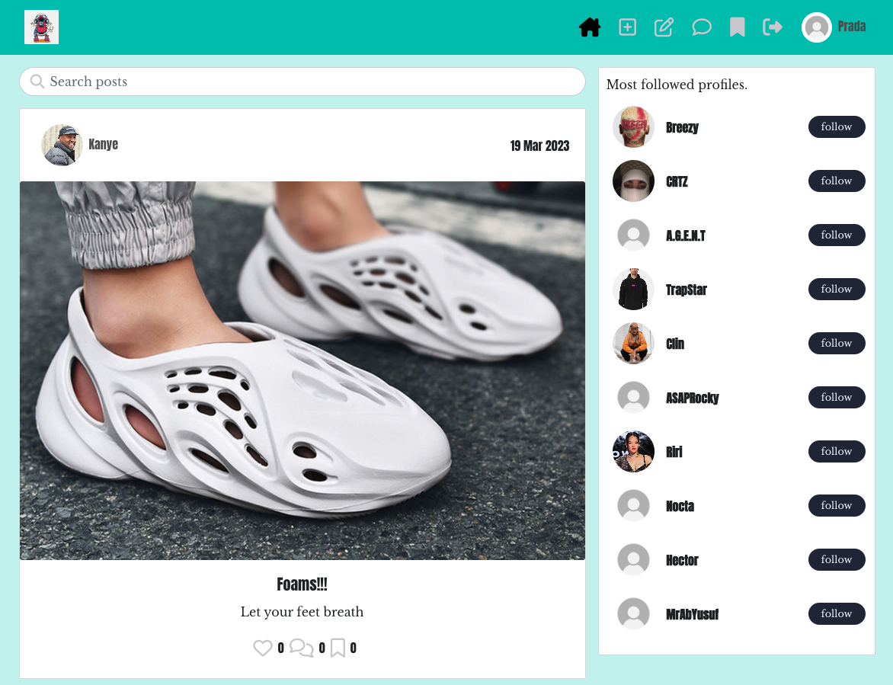
- ##### Home Page mobile
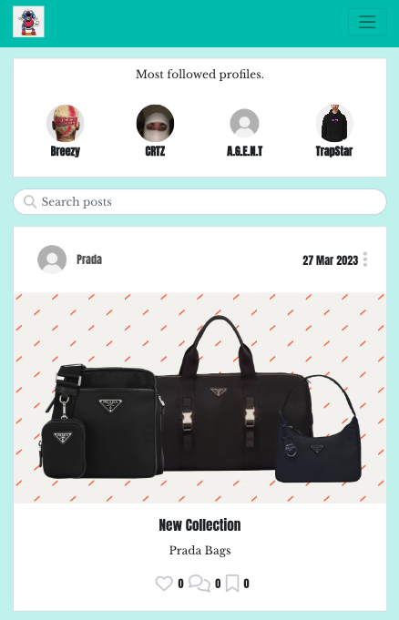
#### Navigation bar
- The navigation bar consists of all the icons with links to all the pages.
- What users can view changes depending if they are signed in or not (see below images)
- ##### Navigation bar when user sign in
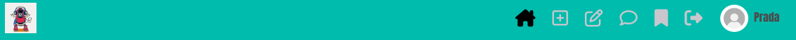
- ##### Navigation bar when user sign out
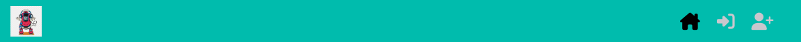
#### Thought Wall
- A thought wall is a page that consists of all users thoughts.
- This is for registered users to share their burning thoughts and have it on a wall for everyone to see.
- On the wall they can let us know their random locations, what they are thinking and what mood they are in.
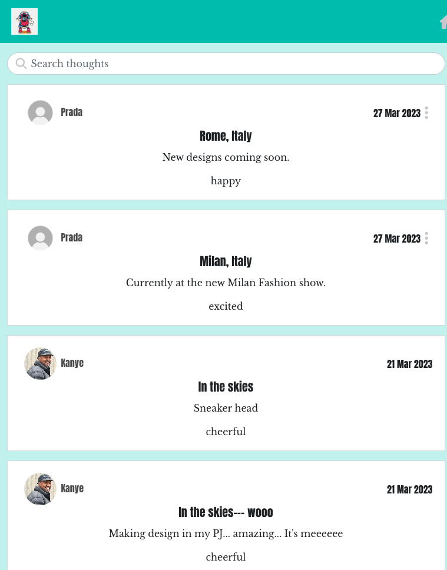
#### Saved Page
- This page consists of all the posts the user likes and would wanna see again.
- Only registered users can save and view this page.
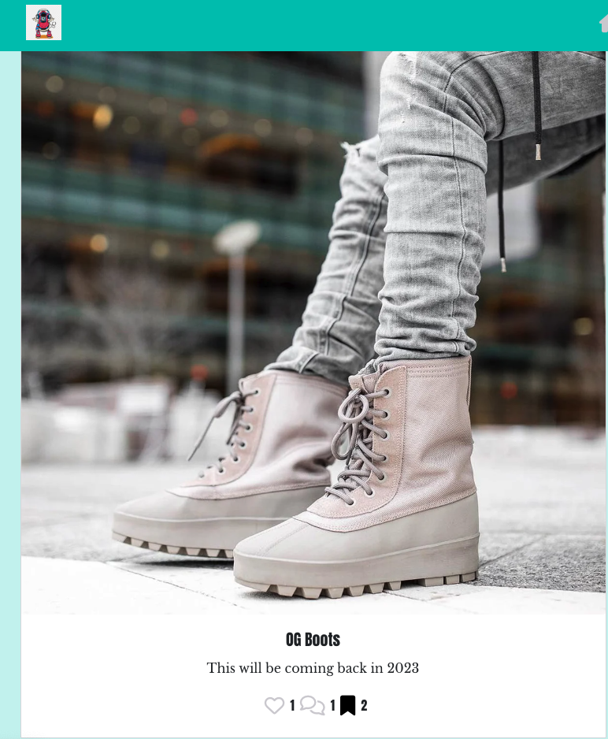
#### Sign in page
- Any user can sign into this page once registered.
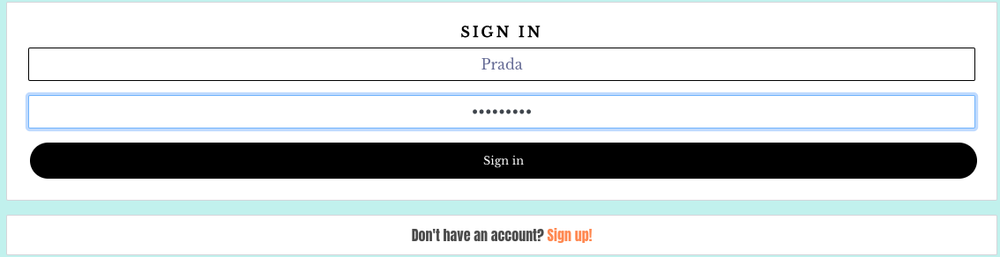
#### Sign up page
- An easy sign up form to have users registered to the application.
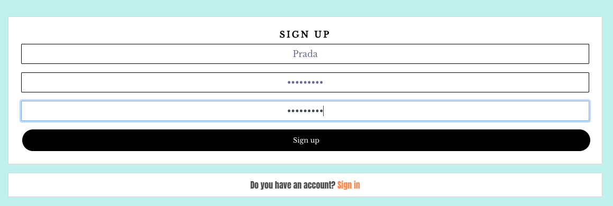
#### Profile page
- The profile page consists of the user avatar and name.
- It has the users statistics for people to see such as posts, thoughts, following and followers.
- It also has the posts and the thoughts the users have posted and shared.
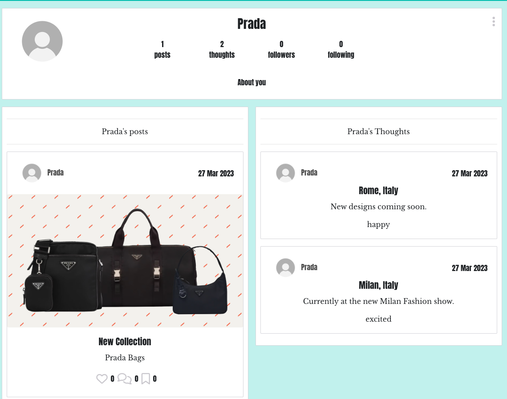


### C.R.U.D:
Few examples of the CRUD functionality:
#### Create Thought
- Registered users are capable of creating and sharing a thought
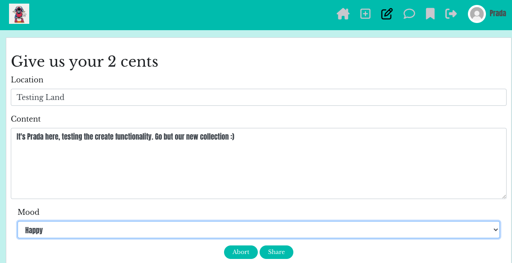
#### Read Thought
- Once thought has been shared, users can then view and read it.
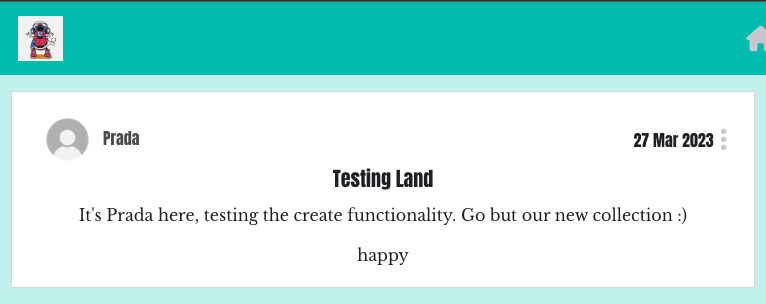
#### Update Thought
- Users are then capable of updating and editing the best to suit them.
   - The content characters are limited to a certian number. 
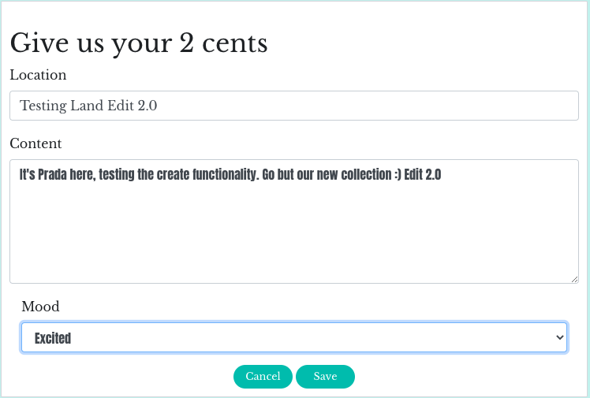
#### Delete Thought
- Users can then delete the thought if they no longer what it on the wall.
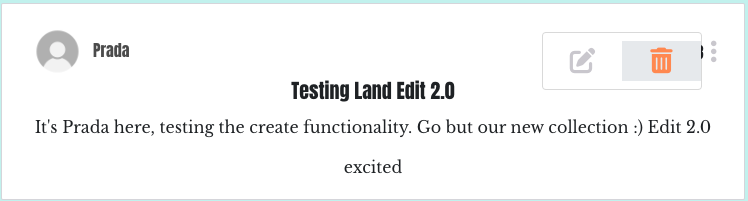

### Features Left to Implement
- To implement notifications so that users can see when other posts.
- To implement direct messaging for users to communicate.
- Increase the word count for posting thoughts.
- For users to be able to repost other users posts or thoughts.
- To create a function that syncs the users location when providing their location on fot thoughts rather than having to write it.

## Technologies Used
### Languages Used
- [HTML5](https://en.wikipedia.org/wiki/HTML)
- [CSS](https://en.wikipedia.org/wiki/CSS)
- [JavaScript](https://en.wikipedia.org/wiki/JavaScript)
- [Python](https://en.wikipedia.org/wiki/Python_(programming_language))
- [Django](https://www.djangoproject.com/)

### Frameworks, Libraries And Programs Used 
1. #### [Font Awesome](https://fontawesome.com/)
   - Font awesome icons were used to create the NavBar pages links.

2. #### [Google Fonts](https://balsamiq.com/)
   - Used for all texts created on this application.

3. #### [Balsamiq](https://balsamiq.com/)
   - Balsamiq was used to create the basic frameworks of the project to which helped to coding the website.

4. #### [Lucid Chart](https://lucid.app/)
   - Used to create Database ERD.

5. #### [Git:](https://git-scm.com/)
   - Git was used in the Gitpod terminal to add, commit and push code to Github.

6. #### [Gitpod:](https://www.gitpod.io/)
   - Gitpod is the Integrated Developer Environment used to code this project.

7. #### [Github:](https://github.com/)
   - Github was used to hold and keep the pushed codes by Git and store projects.

8. #### [Gitpod Python Essentials Template:](https://github.com/Code-Institute-Org/python-essentials-template)
   - Gitpod Python Essentials Template was provided by code institute and it consisted of all the relevant tools needed for the successful running of the application.

9. #### [Heroku](https://id.heroku.com/login)
   - Heroku was used to deploy the project.

10. #### [PostgreSQL](https://www.postgresql.org/)
   - This was used for database.

11. #### [ElephantSQL](https://www.elephantsql.com/)
   - This was used as the new database.

12. #### [Google Fonts](https://fonts.google.com/about)
   - This was used to form the fonts for the page.

13. #### [Favicon](https://www.favicon.cc/)
   - This was used to create an icon for the site tab.

14. #### [ReactJS](https://react.dev/)
    - This was used to create the components required to build a fully front-end application

15. #### [React-Bootstrap](https://react-bootstrap.github.io/)
    - Used to style the layout and design of the application.

## Testing

### Manual Testing
- This application has been manually tested using the C.R.U.D functionality for:
   - Thoughts:
      - As seen above in the CRUD example, user can create, read, update and delete thoughts.
   - Saves:
      - Users can save and unsave posts.
   - Posts:
      - Users can create, read, update and delete posts.
   - Comments:
      - Users can create, read, update and delete comments.
   - Likes:
      - Users can like and unlike posts.
   - Follow:
      - Users can follow and unfollow users.
   - Profile:
      - User can update their profile information.
        - Updating profile
      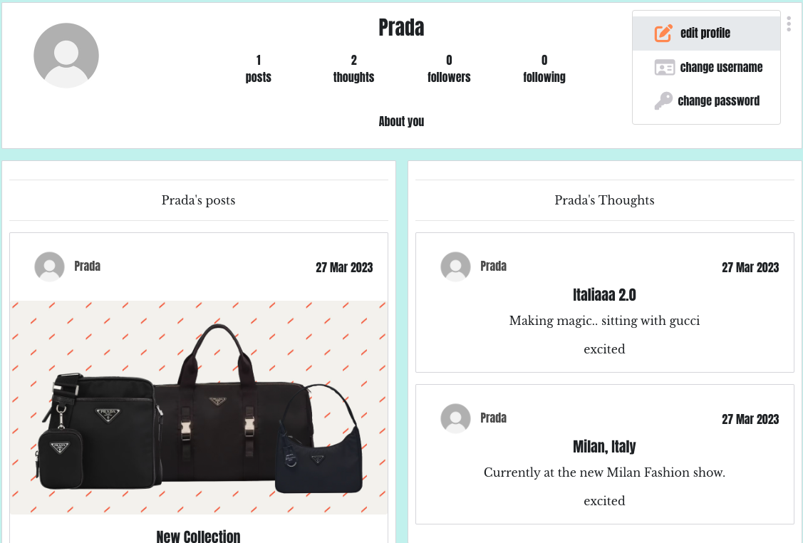
        - Profile updated
      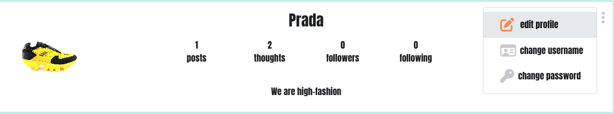
   - All the nav links were manually tested and they all navigated to the correct pages with no issues.
   - Loggin out redirects users to home page.
   - Unregistered users will be redirected when trying to edit content that isn't their own.
   - Registered users can't save their own content.
   - Thoughts wall is just a wall with thoughts and no other functionality as it was intented to be shared for people to only see and not judge.
   - Existing users can log in and out with ease.
   - Unregistered users can become registered by creating a profile.
   - Site is responsive as it should be.

### Validator Testing
#### [CSS Validator](https://jigsaw.w3.org/css-validator/)
   - CSS files passed through [Jigsaw Validator](https://jigsaw.w3.org/css-validator/) with no errors found. 
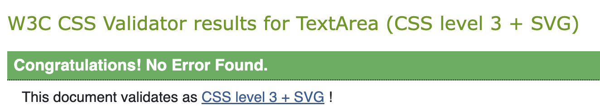
### ESlint
- JSX code was passed through [ESLint](https://eslint.org/) to carry out the tests. There were no ternminal errors or warning observed when testing was done. The setup for this was carried by following the steps on [ESLint](https://eslint.org/docs/latest/use/getting-started):
1. Install npm via this command
```
npm init @eslint/config
```
2. The below file will be created once installed:
```
eslintrc.json
```
3. The following code was then added to check for errors
```
{
	"env": {
		"browser": true,
		"es2021": true
	},
	"extends": [
		"eslint:recommended",
		"plugin:react/recommended",
		"plugin:react/jsx-runtime"
	],
	"parserOptions": {
		"ecmaFeatures": {
			"jsx": true
		},
		"ecmaVersion": 11,
		"sourceType": "module"
	},
	"plugins": ["react"],
	"rules": {
		"react/no-unescaped-entities": ["error", { "forbid": [">", "}"] }],
		"react/prop-types": [0, { "ignore": ["children"] }],
		"react/no-children-prop": [
			0,
			{
				"allowFunctions": true
			}
		]
	}
}
```
- There were no errors found. Although when deploying I can across a few issues which led me to reinstall npm again and also removed React imports for my code.

- JSX code was also ran through an online [ESLint](https://eslint.org/play/) validator for extra checks. Below shows an example of no errors observed.

### Lighthouse Performance

### Unfixed Bugs
- All bugs were fixed before submitting this project.

## Deployment
### Step 1:
#### Prepare and Install frameworks/packages
- Create Github repository and launch Gitpod workspace, install ReactJS
```
npx create-react-app . --use-npm
```
- Load up the application in the browser
```
npm start
```
- Install packages below via npm install:
```
react-bootstrap@1.6.3 bootstrap@4.6.0
react-router-dom@5.3.0
axios
react-infinite-scroll-component
msw --save-dev
jwt-decode
```
- Git add, commit and push all the changes to Github.
- Log in or Sign up to [Heroku](https://www.heroku.com/).
- On dashboard, click "Create New App" or click the "New" dropdown menu on the top right of the page to access "Create New App"
- On the "Create New App" page, name your app (needs to be a unique name), choose a region and click the "Create App" button.
- Scroll back up and locate the "Deploy" tab and select to access the page.
- Once on the "Deploy" page, find "Deployment method" section, select "Github" and click the "Connect to Github" button.
- On "Connect to Github" section, search for your Github repository name you want to deploy by using the empty input field provided and click "Search" to search for the repository name.
- After clicking "Search", repository name should appear and then click "Connect" button beside it. Now everytime you push to Github, you will be able to deploy on Heroku.
- Scroll down, to "Automatic deploys" and "Manual deploy" section. You can deploy via these two options.
- You can set up "Automatic deploys" by clicking on "Enable Automatic Deploys"
- To deploy manually, click the "Deploy Branch" button.
- Finally, you'll see "Your app was successfully deployed" pop up message with a "View" button to access the deployed application.

### Step 2:
#### Connecting API & React
- To connect API to React, on the DRF-API under the setting tab reveal config Vars and add the following:
```
Key: CLIENT_ORIGIN | Value: https://react-app-name.herokuapp.com
Key: CLIENT_ORIGIN_DEV | Value: https://gitpod-browser-link.ws-eu92.gitpod.io
```
- Install the Axios package and create file "axiosDefaults.js"

### Step 3:
####  Deployment to Heroku
- Make sure the below is in your package,json and if not, add the below to the scripts section:
```
"heroku-prebuild": "npm install -g serve",
```
- Create a Profile on the level of the repository and insert the below in it:
```
web: serve -s build
```
- Once again, git add, commit and push all the changes to Github.
- Log in or Sign up to [Heroku](https://www.heroku.com/).
- Scroll back up and locate the "Deploy" tab and select to access the page.
- Once on the "Deploy" page, find "Deployment method" section, select "Github" and click the "Connect to Github" button.
- On "Connect to Github" section, search for your Github repository name you want to deploy by using the empty input field provided and click "Search" to search for the repository name.
- After clicking "Search", repository name should appear and then click "Connect" button beside it. Now everytime you push to Github, you will be able to deploy on Heroku.
- Scroll down, to "Automatic deploys" and "Manual deploy" section. You can deploy via these two options.
- You can set up "Automatic deploys" by clicking on "Enable Automatic Deploys"
- To deploy manually, click the "Deploy Branch" button.
- Finally, you'll see "Your app was successfully deployed" pop up message with a "View" button to access the deployed application.

## Credits
### Content
- The [Code Institue](https://codeinstitute.net/) walkthrough video was used to help form the basic parts of the projects.
- [Code Institue](https://codeinstitute.net/) walkthrough video was used to install all the packages and libraries required for the project.
- [Stack Overflow](https://stackoverflow.com/questions/43527045/react-bootstrap-tooltip-throws-error-react-children-only-expected-to-receive-a) aided with sorting out the overlay trigger function.
- [AZMIND](https://azmind.com/bootstrap-align-center/) helped to align my forms correctly.
- [DigitalOcean](https://www.digitalocean.com/community/tutorials/build-a-to-do-application-using-django-and-react) aided with providing more clarification of the relationship between API and React.
### Media
- All images taken from google.
### Acknowledgments
- #### Tutor Support Team
- Thanks to Joshua for helping me sort out the structure issues for my posts and thoughts on the profile page.
- Thanks to Sean for providing some help with the overlay trigger functionality for the NavBar icons.
- Thanks to Oisin for aiding me with fixing all posts to be for specific to owner's profile.
- Thanks to Ed for helping me sort the statistics for my thoughts count and sorting it out on my API.
- Thanks to Gemma for providing help with my thought form when it's updated.
- #### Fellow classmates/aluminis on Slack
- Thanks to Tony for proviing me with help with the requirement.txt file which caused deployment issues.
- Thanks to Lauren-Nicole for helping me to optimise my thoughts form.
- Thanks Tom for providing help with the MoreDroDown function.
- Thanks to Tom who helped me aided me with setting up eslint and have it working for me.
- #### Mentor
- Thanks to my Mentor for providing with resources to help to form my project.
- Thanks to my Mentor for sharing knowledge and experience about the industry to help me with building.
- Thanks to my mentor for providing constructive critiscm on my project to help me improve it.


